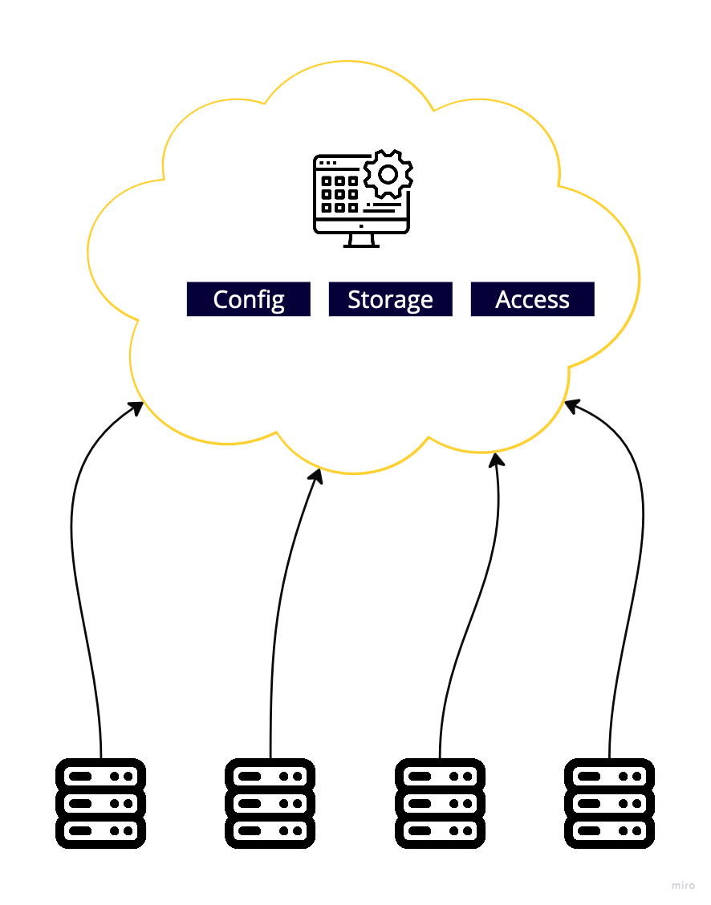

# 3.1 Cloud Native Computing

It's all about hosting the app. It should be hosted in the cloud. While being hosted in the cloud, the application is decoupled from specific servers.  You don't want your app to be tied to a specific server. With that being said, If an app is disconnected from a specific server, facilities must be provided to take care of specific features:
- Access to configuration
- Persistent Storage
- Application Access

Cloud Native takes care of these 🎉

In the above diagram, config, storage, and access should be able to run on any one of the 4 servers. K8s takes care of this.