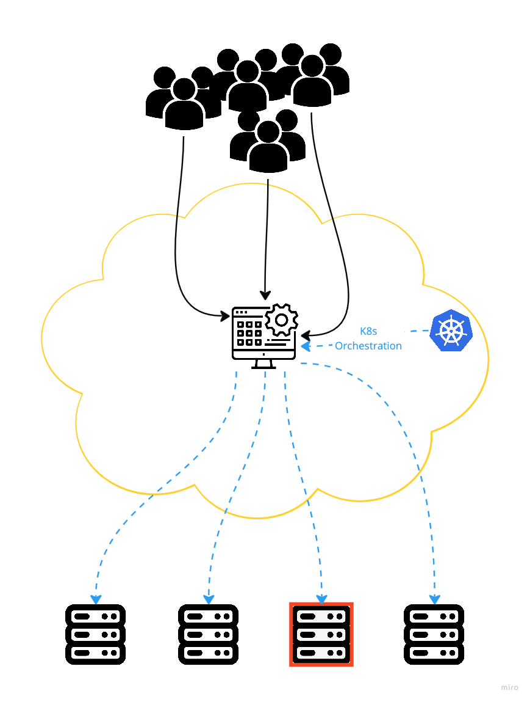

# 3.2 How K8s Enables CNCF
K8s Orchestrates containers. This means that it ensures that they are running where they need to be running. For example:
- If your app os getting a huge influx of traffic, K8s can send traffic to another node.
- If one of your hosts goes down, k8s can send traffic to a healthy node. 

Kubernetes is the open-source platform that allows containers to be used in a cloud native environment.

 To do so, it orchestrates containers, which means that it ensures that containers are running where they need to be running.
 
 Kubernetes also provides scalability: ensuring a sufficient amount of containers are running to deal with the current workload.

The Kubernetes API defines a set of resource types, such as Pods, Deployment, and ConfigMaps that allow for storing information in a cloud native environment where no relation to specific servers exists.

