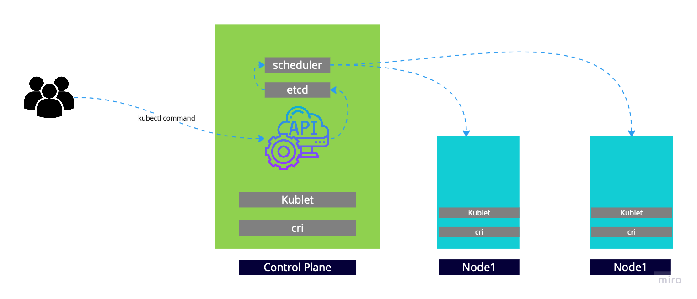

# Architecture 

The control plane consists of one or more modules where the core services are running
- kube-apiserver - Provides access to the API.
- etcd - k8s database
- kube-scheduler - Responsible for scheduling Pods at a specific location
- kibe-controller-manager.

Worker nodes run the containerized applications by using:
- container runtimes - The part that runs containers
- kubelet - The part that is contacted by the kube-scheduler to run the actual container in Pods.

When the user runs the `kubectl` command talks to the API server. When you create resouources (pods in this example), they are added to `etcd`. From there, the scheduler gets your resources from `etcd`, and will find eligible nodes